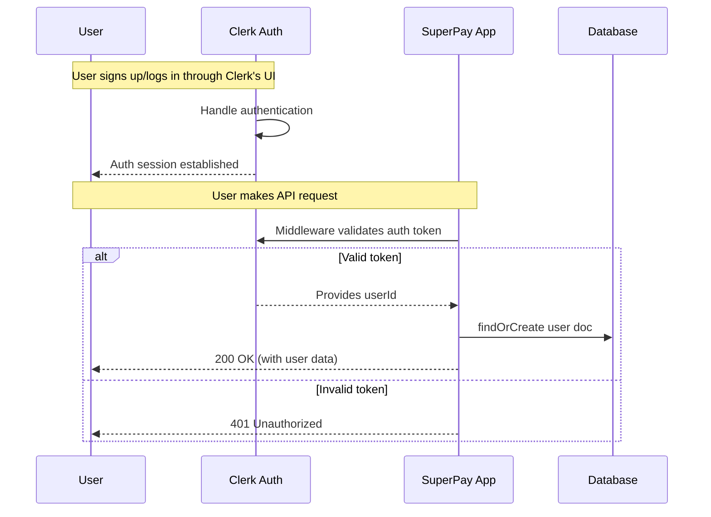
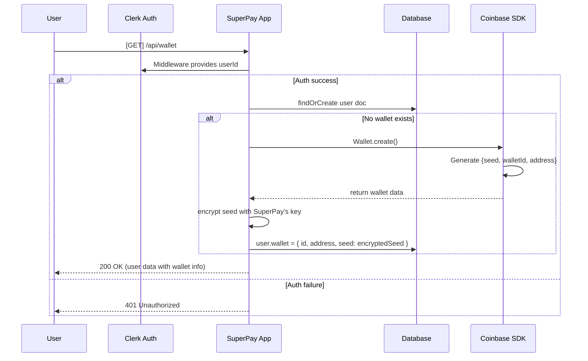
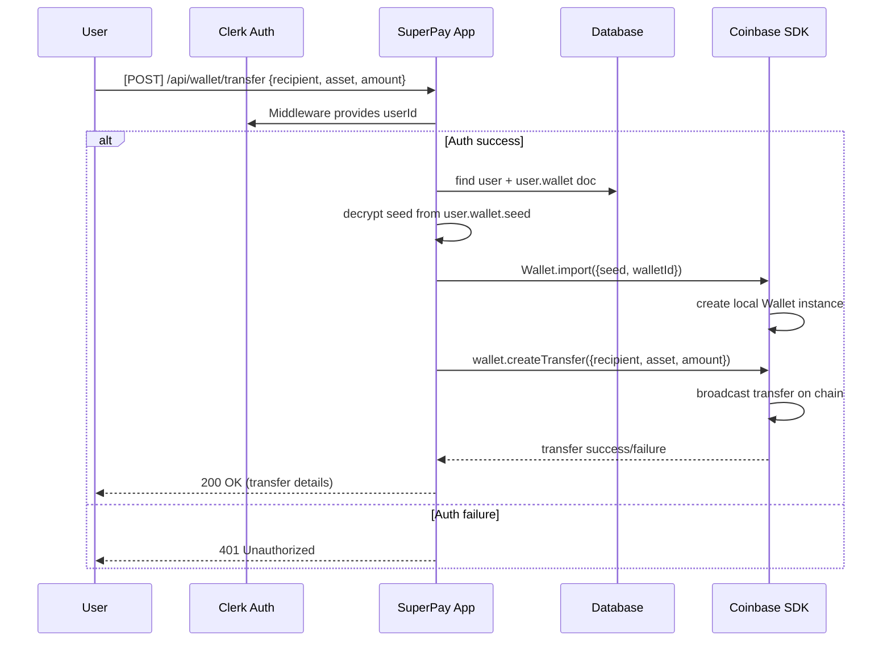
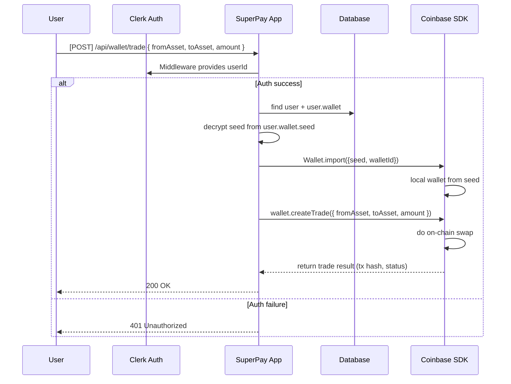
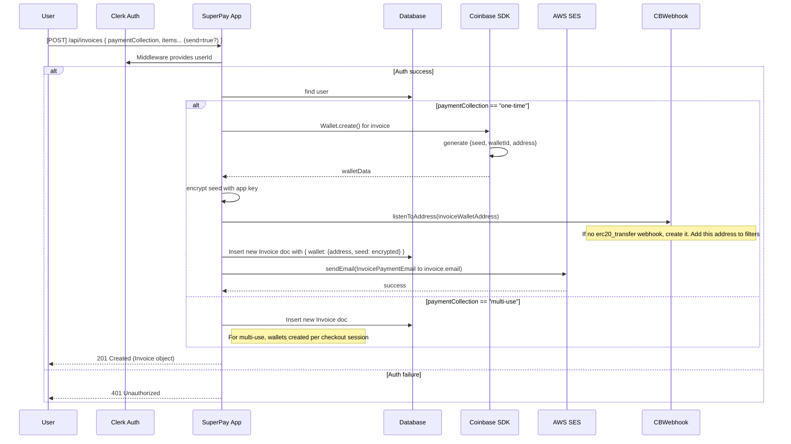
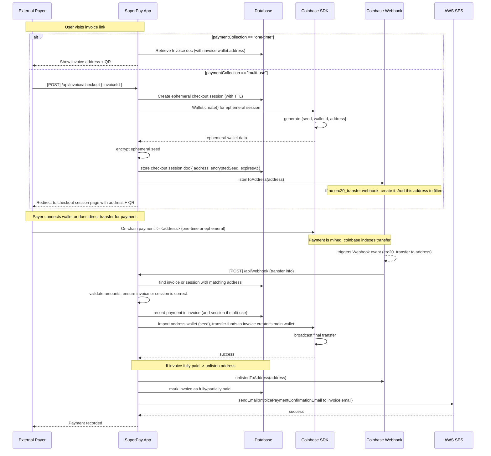
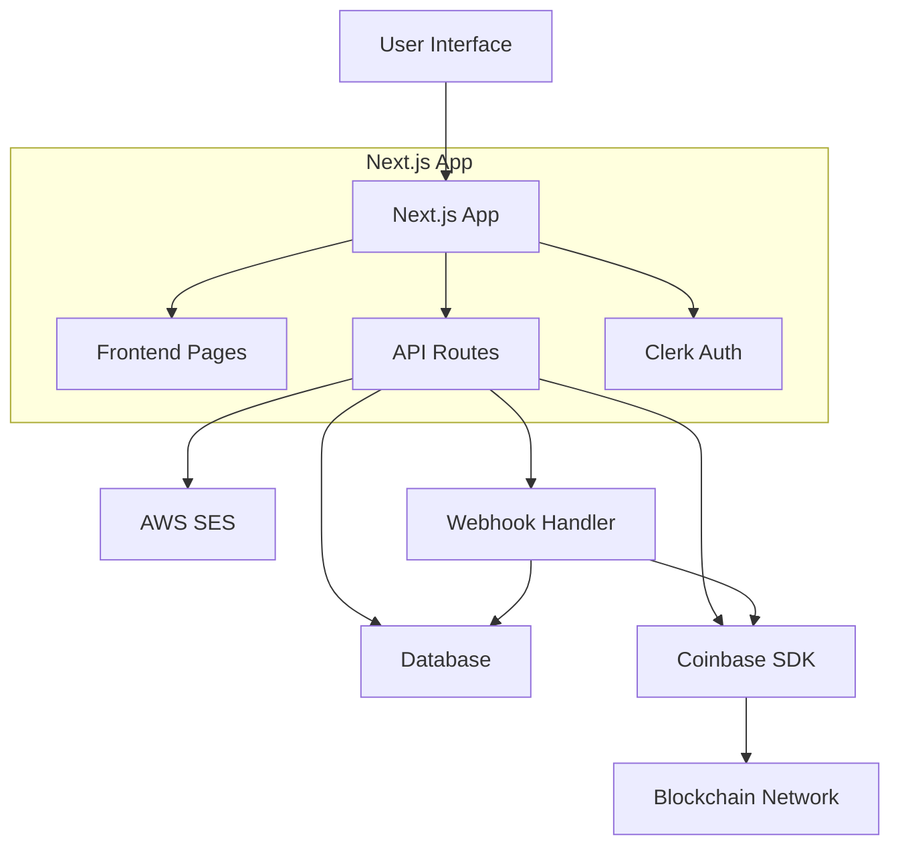
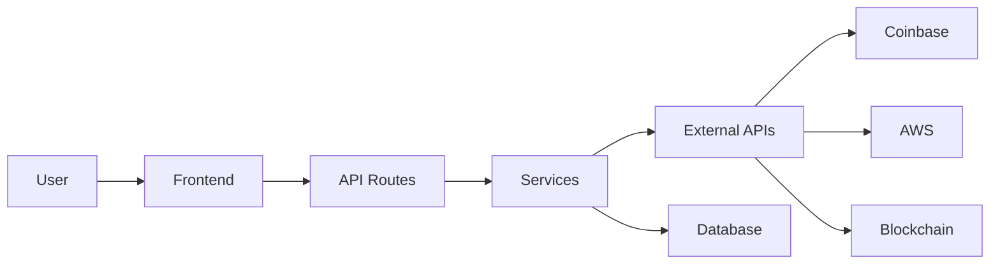

# System Diagrams

This document contains sequence diagrams for all major user flows in the SuperPay application.

## Authentication & User Management

### User Authentication Flow

## Wallet Management

### Wallet Initialization

### Asset Transfer

### Asset Trading

## Invoice System

### Invoice Creation

### Invoice Payment Flow

## System Architecture Overview

## Data Flow Overview
